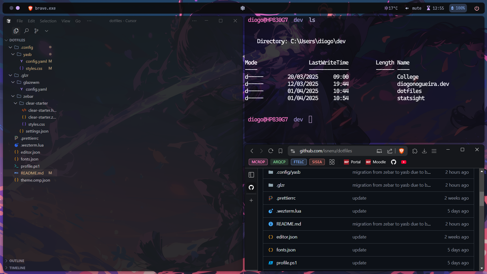

# Dotfiles

```
dotfiles/                            # Description
├── .config/                          # Yasb config
│   ├── yasb/
│   │   ├── config.yaml
│   │   └── styles.css
├── .glzr/                            # Glaze configs
│   ├── glazewm/                        # GlazeWM config
│   │   └── config.yaml
│   └── zebar/                        # Zebar config (UNUSED)
│   ├── clear-starter/                  #  Zebar theme
│   │   ├── clear-starter.html
│   │   ├── clear-starter.zebar.json
│   │   └── styles.css
│   └── settings.json                 # Zebar settings
├── .prettierrc                       # Prettier config
├── .wezterm.lua                      # Wezterm config
├── editor.json                       # Editor config
├── fonts.json                        # Fonts
├── terminal.ps1                      # Powershell config
├── theme.omp.json                    # Oh My Posh theme
└── README.md                         # (this.fileName)
```

## Tools used

- [GlazeWM](https://github.com/glzr-io/glazewm)
- [WezTerm](https://github.com/wezterm/wezterm)
- [Oh My Posh](https://github.com/JanDeDobbeleer/oh-my-posh)
- [Yasb](https://github.com/amnweb/yasb)

## Tools unused

- [Zebar](https://github.com/glzr-io/zebar)

## Requirements

### Fonts:

- JetBrains Mono Nerd Font (Yasb)
- Roboto (Yasb Home Menu)
- Cascadia Mono Nerd Font (WezTerm)

## Preview


