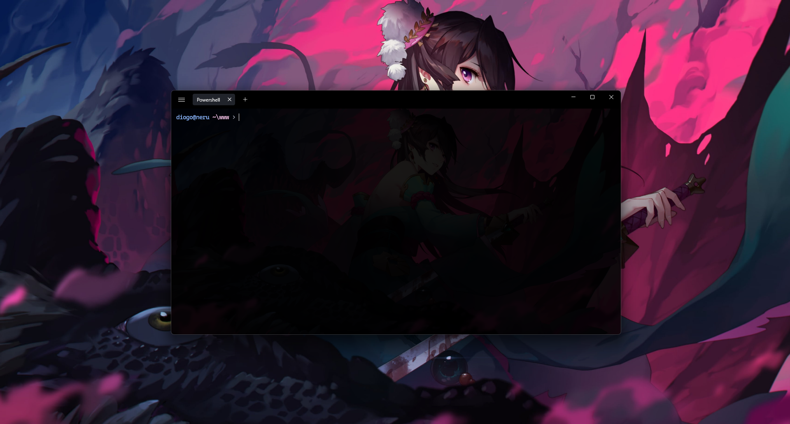

# dotfiles

This repository contains my dotfiles, including my Neovim configuration in `lua`.

  
<h2>Gallery</h2>

|  |
|:--:|
| *Preview* |
  

## Setup
- Terminal Emulator: [FluentTerminal](https://github.com/felixse/FluentTerminal)
- Prompt: [oh-my-posh](https://github.com/JanDeDobbeleer/oh-my-posh)
- [Wallpaper](https://github.com/isneru/dotfiles/wallpaper.jpg)

## Other info
- Terminal background opacity: 90%
- Theme: Catppuccin Mocha
